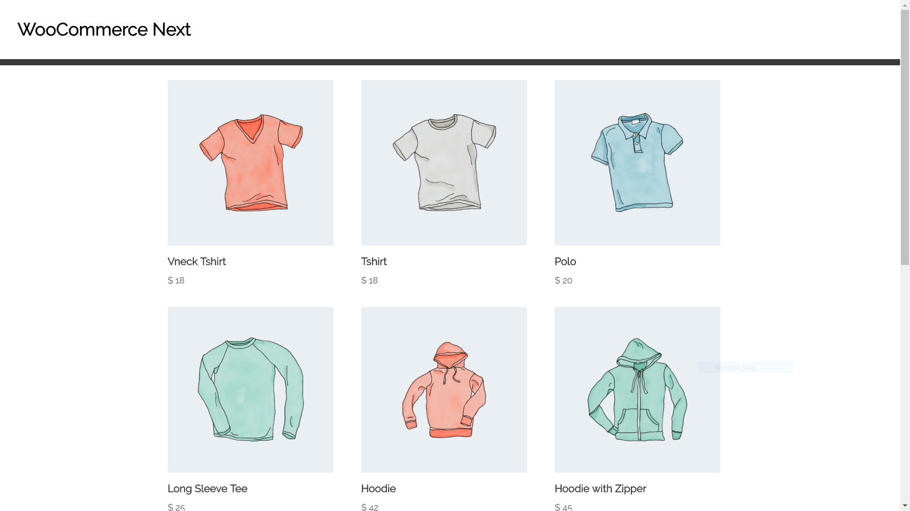

# WooCommerce Next

An example app to learn Next.js with React Hooks. I'm using a WooCommerce Backend to fetch data.



## Progress

- Lists all products in the home page
- Routing with express for dev
- Routing for now 2 (serverless)
- Single product page


## TODO

- Cart management
- Pleasing design

### Getting started with Next.js

- Create a `pages` folder with an `index.js` file with the following code:

```jsx
import Link from "next/link";
import Header from "../components/header";

export default () => (
  <main>
    <Header />
    <section>
      <Link href="/about">
        <a>Go to About Me</a>
      </Link>
    </section>
  </main>
);
```

- Now lets create an `about.js` file inside the `pages` folder with the following code:

```jsx
import { Component } from "react";
import Link from "next/link";
import Header from "../components/header";

class AboutPage extends Component {
  static getInitialProps() {
    const isServer = typeof window === "undefined";
    return { isServer };
  }

  render() {
    return (
      <main>
        <Header />
        <section>
          <p>
            This is another page of the SSR example, you accessed it{" "}
            <strong>{this.props.isServer ? "server" : "client"} side</strong>.
          </p>
          <p>
            You can reload to see how the page change.
          </p>
          <Link href="/">
            <a>Go to Home</a>
          </Link>
        </section>
      </main>
    );
  }
}

export default AboutPage;
```

- As you might noticed we have a component that is shared by both `index.js` and `about.js` files, let's create that one now. Create a folder named `components` with a file named `header.js` in it and add the following code:

```jsx
export default () => (
  <header>
    <h1>Next.js Example</h1>
  </header>
);
```

- Finally in order for Next.js to be deployed we could either have a `next.config.js` or a `package.json`, for this example we are just going to create a `next.config.js` with the following code:

```js
module.exports = {}
```

### Deploy with Now

First we need to create a `now.json` configuration file to instruct Now how to build the project.

For this example we will be using our newest version [Now 2.0](https://zeit.co/now).

By adding the `version` key to the `now.json` file, we can specify which Now Platform version to use.

We also need to define each builders we would like to use. [Builders](https://zeit.co/docs/v2/deployments/builders/overview/) are modules that take a deployment's source and return an output, consisting of [either static files or dynamic Lambdas](https://zeit.co/docs/v2/deployments/builds/#sources-and-outputs).

In this case we are going to use `@now/next` to build and deploy our Next.js application selecting the `next.config.js` as our entry point. We will also define a name for our project (optional).

```json
{
    "version": 2,
    "name": "nextjs",
    "builds": [
        { "src": "next.config.js", "use": "@now/next" }
    ]
}
```

Visit our [documentation](https://zeit.co/docs/v2/deployments/configuration) for more information on the `now.json` configuration file.

We are now ready to deploy the app.

```
now
```
